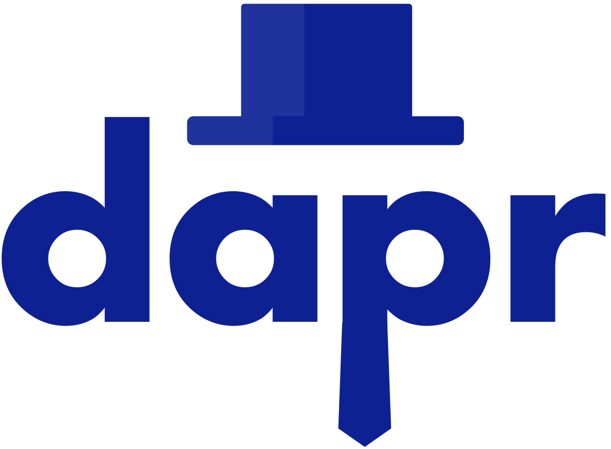

# Dapr Dev Container

## Objectives

This project aims to demonstrate the usage of [Dapr](https://dapr.io/) with a vscode devcontainer. This project is based on the following tutorial [https://azure.github.io/Cloud-Native/blog/14-dapr-aca-quickstart/](https://azure.github.io/Cloud-Native/blog/14-dapr-aca-quickstart/) and add the support of devcontainer to use Dapr localy. The sample application is built with .Net Framework and illustrate the asynchronous communication usage with Dapr. 


## Requirements

You must have access to an Azure Subscription, where you can create an azure service bus namespace.

## Startup procedure

1. Open the dev container with vsCode

2. Install Dapr by running the following command

    wget -q https://raw.githubusercontent.com/dapr/cli/master/install/install.sh -O - | /bin/bash

3. Init Dapr by launching the following command

    dapr init

4. If the vscode dapr extension is not automatically installed, please add it by hand by using the extension manager. Open it an look for the extension called "
ms-azuretools.vscode-dapr"

5. On Azure, create a service bus topic 

```bash
az login --use-device-code
export RESOURCE_GROUP="orders-services-rg"
export LOCATION="northeurope"
az group create --name $RESOURCE_GROUP --location $LOCATION

export NamespaceName="ordersservicesobs"
export TopicName="orderreceivedtopic"
export TopicSubscription="orders-processor-subscription"

##Create servicebus namespace
az servicebus namespace create --resource-group $RESOURCE_GROUP --name $NamespaceName --location $LOCATION

##Create a topic under namespace
az servicebus topic create --resource-group $RESOURCE_GROUP --namespace-name $NamespaceName --name $TopicName

##Create a topic subscription
az servicebus topic subscription create --resource-group $RESOURCE_GROUP --namespace-name $NamespaceName --topic-name $TopicName --name $TopicSubscription

##List connection string
az servicebus namespace authorization-rule keys list --resource-group $RESOURCE_GROUP --namespace-name $NamespaceName --name RootManageSharedAccessKey --query primaryConnectionString --output tsv

```

6. launch the application
  
```bash
cd Orders.Processor
dapr run --app-id orders-processor --app-port 5039 --dapr-http-port 3500 --components-path "../dapr-components" dotnet run
```

## Related links

For those who need more information about Dapr with nodejs applications you can checkout my colleague repo here : [https://github.com/alexsaker/dapr-demo](https://github.com/alexsaker/dapr-demo).